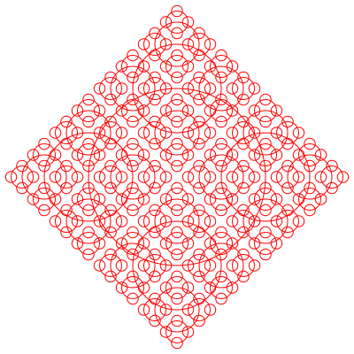

# Svg Image Writer for Rust

The project provides abilities to generate basic svg shape/group image.

thanks to Joni's tutorial: [SVG Pocket Guide](http://svgpocketguide.com/)

## Getting Started

This library's target is to generate combined shapes progmatically.

## Usage(check rustdoc to see the detail)

Basic steps:
1. create canvas: Svg::new(with, height);
2. create shape and add to canvas: svg.add_shape(Shape::Rect(Rect::new(...;
3. create a style for this shape: Sstyle::new();
4. set style: sstyle.fill = Some(#BBC42A".to_string());
4. create a group: Group::new();
5. place the shape in the group in somewhere, and set its style: group.place_widget(Widget(shape_id:..., at:..., style:..., ..Default::default()));
6. set group as default group;
7. use svg_out to generate svg content;

## License

MIT See [LICENSE](../../../LICENSE) file.

## Showcases

### Generate recursive svg image:

