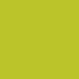

# Svg Image Writer for Rust

The project provides abilities to generate basic svg shape/group image.

thanks to Joni's tutorial: [SVG Pocket Guide](http://svgpocketguide.com/)

## Getting Started

This library's target is to generate combined shapes progmatically.

## Usage

Basic steps:
1. create canvas: Svg::new(with, height);
2. create shape and add to canvas: svg.add_shape(Shape::Rect(Rect::new(...;
3. create a style for this shape: Sstyle::new();
4. set style: sstyle.fill = Some(#BBC42A".to_string());
4. create a group: Group::new();
5. place the shape in the group in somewhere, and set its style: group.place_widget(Widget(shape_id:..., at:..., style:..., ..Default::default()));
6. set group as default group;
7. use svg_out to generate svg content;

```
use simple_svg::*;

let mut svg = Svg::new(100.0, 100.0);

let rect_id = svg.add_shape(Shape::Rect(Rect::new(100.0, 100.0)));

let mut rect_sstyle = Sstyle::new();
rect_sstyle.fill = Some("#BBC42A".to_string());

let mut group = Group::new();
group.place_widget(Widget {
    shape_id: rect_id,
    style: Some(rect_sstyle),
    ..Default::default()
});

svg.add_default_group(group);

let svg_str = svg_out(svg);

let contents = include_str!("../showcase/shapes/rect/rect.svg");

assert_eq!(svg_str, contents);
```




All the usage of Shape, Group, Filter etc, please check rustdoc.

## License

MIT See [LICENSE](../../../LICENSE) file.
