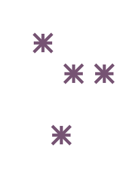

```
use simple_svg::*;

let mut svg = Svg::new(220.0, 280.0);

let line1_id = svg.add_shape(Shape::Line(Line::new((0.0, 0.0), (30.0, 30.0))));
let line2_id = svg.add_shape(Shape::Line(Line::new((0.0, 15.0), (30.0, 15.0))));
let line3_id = svg.add_shape(Shape::Line(Line::new((15.0, 0.0), (15.0, 30.0))));
let line4_id = svg.add_shape(Shape::Line(Line::new((30.0, 0.0), (0.0, 30.0))));

let mut line_sstyle = Sstyle::new();
line_sstyle.stroke = Some("#765373".to_string());
line_sstyle.stroke_width = Some(5.0);

let mut group = Group::new();

group.place_widget(Widget {
    shape_id: line1_id,
    style: Some(line_sstyle.clone()),
    at: Some((5.0, 5.0)),
    ..Default::default()
});

group.place_widget(Widget {
    shape_id: line2_id,
    style: Some(line_sstyle.clone()),
    at: Some((5.0, 5.0)),
    ..Default::default()
});

group.place_widget(Widget {
    shape_id: line3_id,
    style: Some(line_sstyle.clone()),
    at: Some((5.0, 5.0)),
    ..Default::default()
});

group.place_widget(Widget {
    shape_id: line4_id,
    style: Some(line_sstyle.clone()),
    at: Some((5.0, 5.0)),
    ..Default::default()
});

let group_id = svg.add_group(group);

let mut default_group = Group::new();

default_group.place_widget(Widget {
    shape_id: group_id.clone(),
    at: Some((50.0, 50.0)),
    ..Default::default()
});

default_group.place_widget(Widget {
    shape_id: group_id.clone(),
    at: Some((100.0, 100.0)),
    ..Default::default()
});

default_group.place_widget(Widget {
    shape_id: group_id.clone(),
    at: Some((80.0, 200.0)),
    ..Default::default()
});

default_group.place_widget(Widget {
    shape_id: group_id.clone(),
    at: Some((150.0, 100.0)),
    ..Default::default()
});

svg.add_default_group(default_group);

let svg_str = svg_out(svg);

let contents = include_str!("../../showcase/group/group1.svg");

assert_eq!(svg_str, contents);
```


